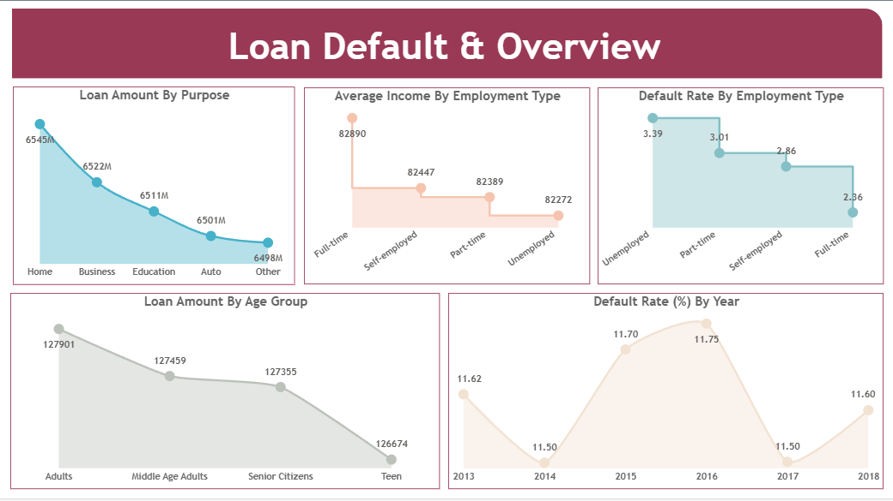
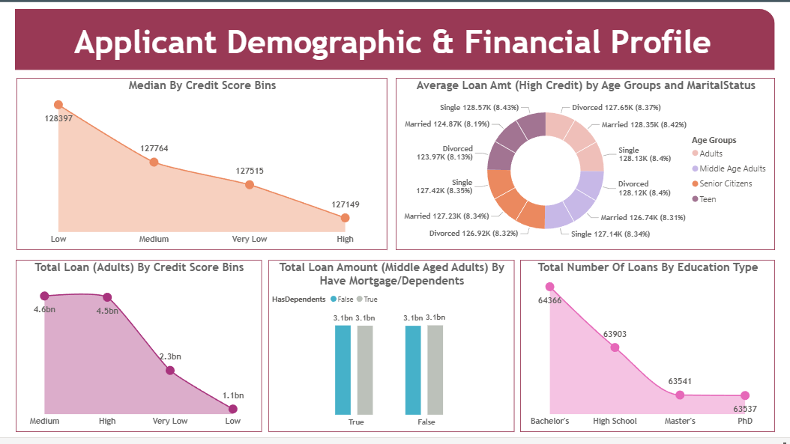
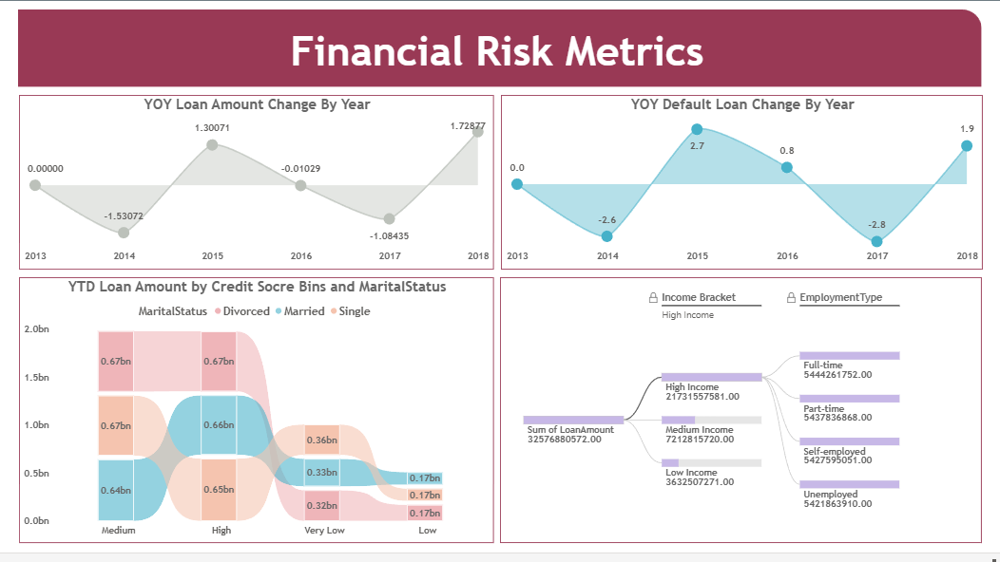

# Loan Default and Risk Analytics – Power BI

## Project Overview
This project is an end-to-end Power BI solution designed to analyze loan default behavior and
financial risk using enterprise-level data architecture, advanced DAX measures, and interactive
dashboards.

---

## Data Architecture & Tools
- **Database**: Microsoft SQL Server  
- **Data Ingestion**: Power BI Dataflows (Gen1 – Power BI Fabric)  
- **Connectivity**: On-Premises Data Gateway  
- **Visualization**: Power BI Desktop & Power BI Service  
- **Language**: DAX  

---

## 📊 Dashboard Pages

### Loan Default & Overview
Provides a high-level summary of loan distribution and default patterns:
- Loan Amount by Purpose
- Average Income by Employment Type
- Default Rate by Employment Type
- Loan Amount by Age Group
- Default Rate (%) by Year

---

### Applicant Demographic & Financial Profile
Analyzes borrower demographics and financial characteristics:
- Median Loan Amount by Credit Score Bins
- Average Loan Amount (High Credit) by Age Group & Marital Status
- Total Loan (Adults) by Credit Score Bins
- Loan Amount (Middle-Aged Adults) by Mortgage & Dependents
- Total Number of Loans by Education Type

---

### Financial Risk Metrics
Focuses on trend analysis and risk indicators:
- Year-over-Year (YOY) Loan Amount Change
- YOY Default Loan Change
- Year-to-Date (YTD) Loan Amount Analysis
- Decomposition Tree for income and employment insights

---

## Key Concepts & Skills Demonstrated
- Advanced DAX: `CALCULATE`, `FILTER`, `ALL`, `ALLEXCEPT`, `MEDIANX`
- Time Intelligence: YOY and YTD calculations
- Dataflows & Gateway configuration
- Financial risk and default analysis
- Interactive dashboards with drill-downs

---

## Live Dashboard
View the interactive Power BI report here:  
https://app.powerbi.com/view?r=eyJrIjoiMmQ0NmZmZWYtN2Y4OS00NDgyLWE3YzEtZTFiZTMyYzk0ZTI3IiwidCI6IjIwMDE0NzcwLTM3YWEtNDQ1ZC04MTNkLTVlNjhmMTI3MTgyYyJ9

---

## Power BI Report File
The complete Power BI report is available in the repository as a `.pbix` file and contains the full
data model, DAX measures, and report pages used to build the live dashboard.

---

## Author
**Aniket Aman**
